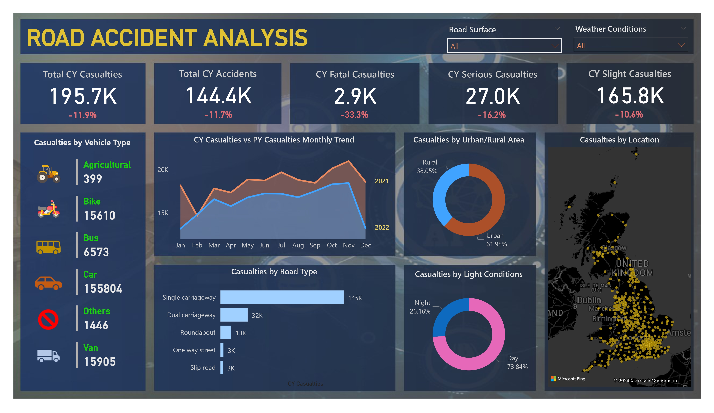

# ROAD ACCIDENT ANALYSIS

This data analysis project employs Microsoft Power BI and MS Excel to investigate and visualize patterns within a diverse dataset of road accidents in the UK in the years 2021 and 2022. Initial steps involve gathering and cleaning data, ensuring accuracy and consistency. Geo-spatial analysis in Power BI helps identify the accident hot spots. The ultimate goal is to develop an interactive dashboard in Microsoft Power BI, providing users with a dynamic platform to explore the data, apply filters and gain insights. The dataset was collected from an external source.

## Requirement

Client wants to create a Road Accident Dashboard for year 2021 and 2022 so that they can have insight on the below requirements:
- Primary KPI - Total Casualties and Total Accident values for Current year and YoY growth.
- Primary KPI - Total Casualties by Accident Severity for Current year and YoY growth.
- Secondary KPI - Total Casualties with respect to vehicle type for Current year.
- Monthly trend showing comparison of casualties for Current year and Previous year.
- Casualties by Road Type for Current year.
- Current year casualties by Area/Location and by Day/Night.
- Total Casualties and Total Accidents by location.

## Screenshots

*Dashboard of the analysis of Road Accidents in the UK in the years 2021 and 2022.*